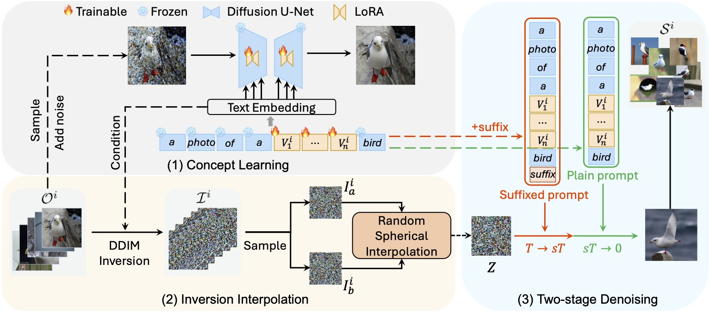

# Pytorch implementation of "Inversion Circle Interpolation: Diffusion-based Image Augmentation for Data-scarce Classification"

**Diff-II is a novel and effective generative data augmentation method.**




> [**Inversion Circle Interpolation: Diffusion-based Image Augmentation for Data-scarce Classification**](https://arxiv.org/pdf/2408.16266)
> Yanghao Wang, Long Chen               

# Updates
- (12/2024) Code is released.


# Get Start
## Environment
Create a conda environment and activate it with the following command:
```bash
conda env create -f environment.yaml
conda activate diff-ii
```
If this takes too long, `conda config --set solver libmamba` sets conda to use the `libmamba` solver and could speed up installation.

## Download datasets, learned concepts, and suffixes
This may take some time.
```bash
bash scripts/download.sh
```

## Run code
Depending on your needs, modify the scripts/run.sh file and run.
```bash
bash scripts/run.sh
```

# Citing Diff-II

If you use Diff-II in your research or wish to refer to the baseline results published here, please use the following BibTeX entry.

```BibTeX
@article{wang2024improving,
  title={Improving diffusion-based data augmentation with inversion spherical interpolation},
  author={Wang, Yanghao and Chen, Long},
  journal={arXiv preprint arXiv:2408.16266},
  year={2024}
}
```

